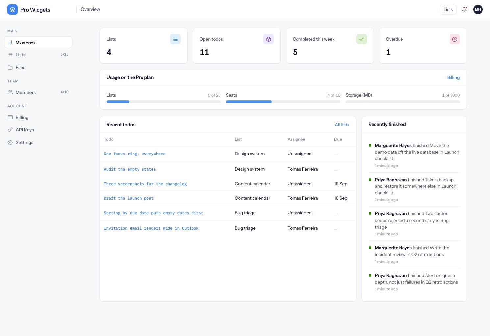
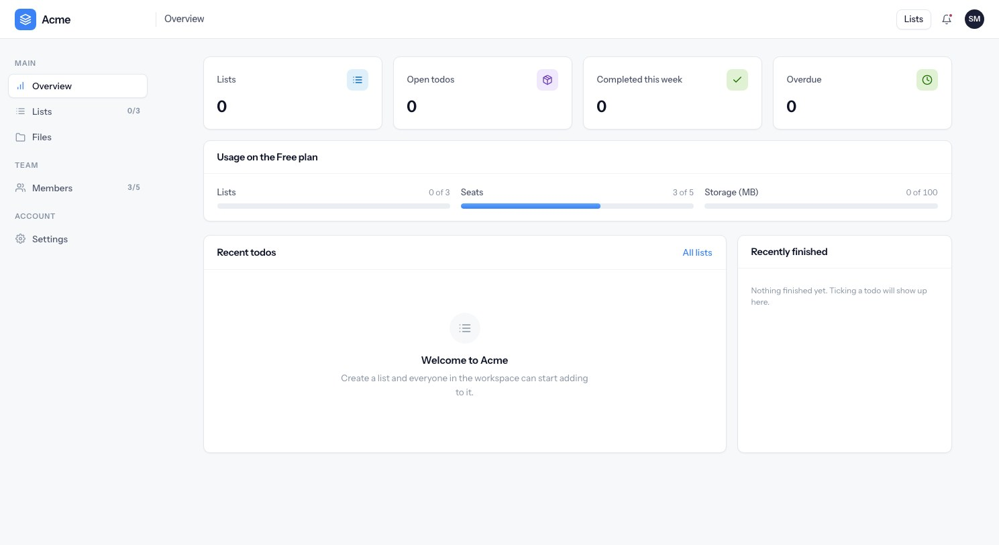
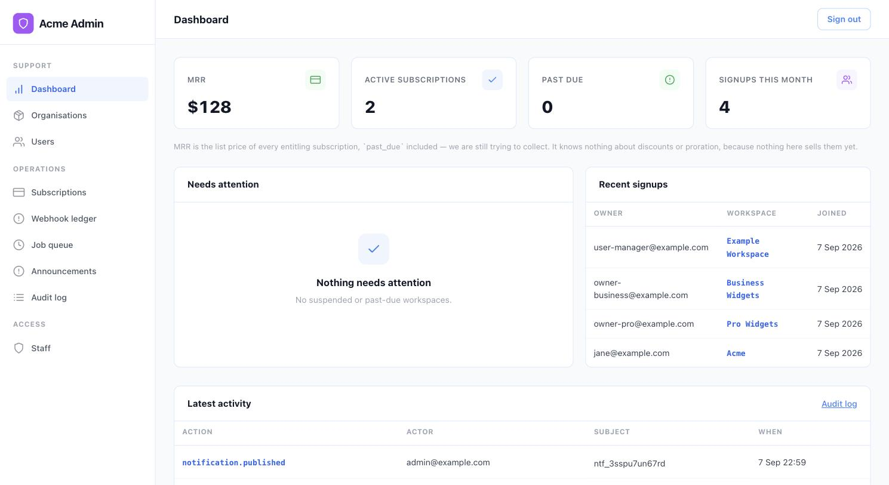
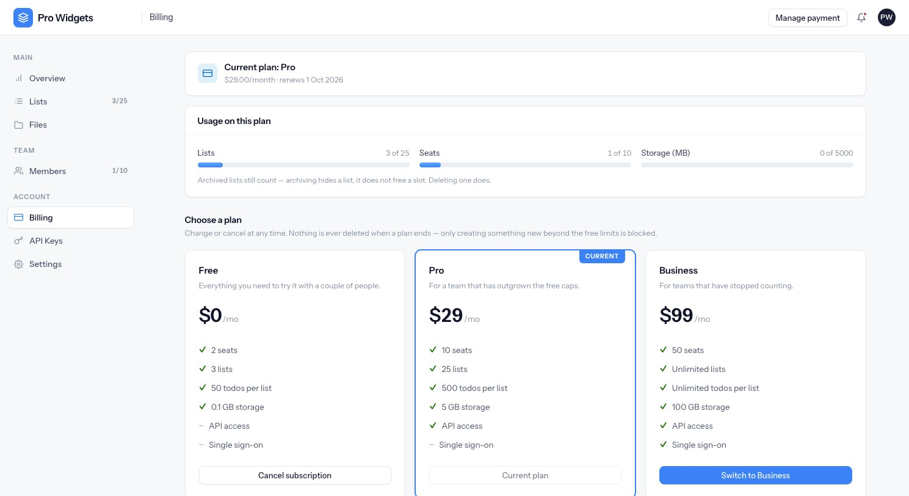
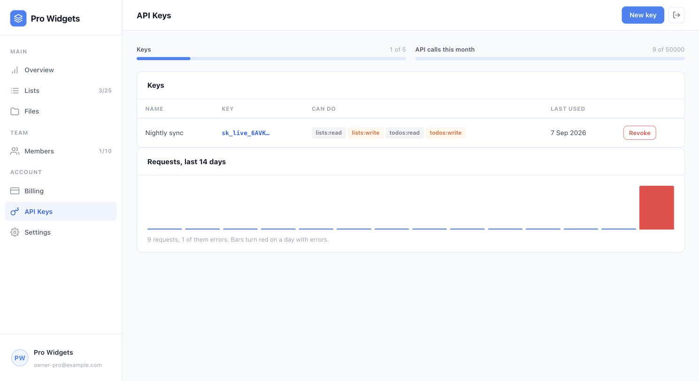
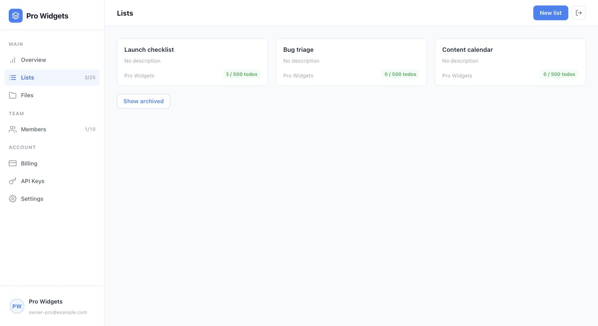
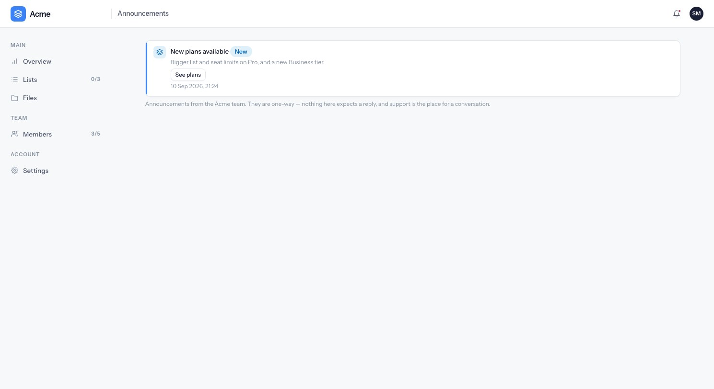

<div align="center">


# 🧱 Multi-tenant SaaS Starter

**A production-shaped AdonisJS v7 SaaS boilerplate — organisations, plan-gated limits,
subscriptions, background jobs, file storage, a public API and a support back-office.**

🐿️ SQLite locally with zero setup · 🐘 PostgreSQL when deployed · 🧪 599 tests on both

[Features](#-features) · [Quick start](#-quick-start) · [Environment](#-environment) ·
[Screenshots](#-screenshots) · [Stack](#-stack) · [Commands](#-commands)

</div>

---

## 🤔 What this is

A **kitchen-sink starter** for a subscription SaaS. Not a demo: the awkward parts — the ones that
usually get skipped and then bite in month three — are the parts that are actually built.

- 💳 A **failed payment doesn't lock anyone out**, and a downgrade never deletes anything.
- 🔒 Every tenant-owned query filters on `organization_id`, with a dedicated test suite that seeds
  two workspaces and asserts, endpoint by endpoint, that one can never touch the other.
- 🧮 Quotas are enforced **inside the insert transaction behind a row lock**, so two parallel
  requests can't both take the last slot — proven by concurrency tests on PostgreSQL.
- 🪝 Webhooks are idempotent, ordered by watermark, and replayable from a stored payload.
- 🕵️ Staff impersonation is time-boxed, read-only for support, and audited with **both** actor ids.

The demo domain is deliberately small — shared to-do lists — because it exists to exercise tenancy,
quotas and the API, not to be the product. Swap it for yours.

📓 [`plan.md`](./plan.md) is the full design document and the source of truth for scope.
🛠️ [`CONTRIBUTING.md`](./CONTRIBUTING.md) has the rules that keep it working — read it before
changing anything.

---

## ✨ Features

| | Feature | What you get |
|---|---|---|
| 🔐 | **Authentication** | Register, login, logout, email verification, password reset |
| 🔑 | **Two-factor auth** | TOTP with QR enrolment, recovery codes, mandatory for staff |
| 🌐 | **Social login** | Google & GitHub via Ally, with account linking |
| 🏢 | **Organisations** | One workspace per user, owner/member roles, ownership transfer |
| 📨 | **Invitations** | Tokenised invites, expiry, revoke, resend, seat-limit enforcement |
| 💳 | **Subscriptions** | Creem behind a `PaymentProvider` interface — swap in Stripe with one class |
| 🪝 | **Webhooks** | Signature-verified, idempotency ledger, queued application, replay + sync |
| 📊 | **Plan limits** | Seats, lists, todos-per-list, storage, API keys, monthly API calls |
| 🚦 | **Soft-lock quotas** | Over-limit workspaces keep every row, readable *and* editable — only creation blocks |
| 🎛️ | **Usage meters** | Amber at 80%, red at 100%, from the same numbers that enforce the limit |
| 📁 | **File storage** | Local disk → Cloudflare R2 by one env var, signed URLs, MIME sniffing |
| 🗑️ | **Recoverable deletes** | Files and announcements are soft-deleted with a 30-day purge job |
| ⚙️ | **Background jobs** | Database-backed queue, exponential backoff, crash recovery, admin retry |
| 📧 | **Transactional email** | Resend in production, Mailpit locally, every send through the durable queue |
| 🔌 | **Organisation API** | `/api/v1`, bearer keys, scopes, cursor pagination, OpenAPI + `/docs` |
| ⏱️ | **Rate limiting** | Per-key burst + per-workspace monthly quota, headers on every response |
| 🛡️ | **Hardened front door** | Throttled sign-in, signup, reset and 2FA, keyed so nobody can lock out a stranger |
| 🔒 | **Security headers** | Nonce-based CSP, HSTS, frame denial, referrer and permissions policy |
| 🧑‍💼 | **Back-office** | Org/user search, subscription sync, webhook ledger, job queue, audit log |
| 🕵️ | **Impersonation** | Time-boxed, banner on every screen, read-only for support, fully audited |
| 📣 | **Announcements** | One-way in-app notices targeted by plan, owners, or named people |
| 📜 | **Audit trail** | Append-only, two-year retention, filterable, both ids under impersonation |
| 🎨 | **UI kit** | Edge + Alpine + custom CSS — no Tailwind, no component framework |
| 🐳 | **Ships as an image** | Multi-stage Dockerfile, non-root, plus a compose stack of web + worker + Postgres |
| 🩺 | **Health checks** | `/health` for restarts, `/ready` for the load balancer — they answer different questions |
| 🧪 | **Tests** | 628 tests, including a real-browser suite, run against SQLite **and** PostgreSQL in CI |

---

## 🚀 Quick start

You need **Node 24+**. Nothing else — SQLite needs no server.

```bash
# 1️⃣  Install
npm install

# 2️⃣  Configure
cp .env.example .env
node ace generate:key          # writes APP_KEY

# 3️⃣  Create the database and demo data
node ace migration:fresh --seed

# 4️⃣  Run it
npm run dev                    # 🌐 http://localhost:3333
node ace queue:work            # ⚙️  second terminal — nothing is emailed without it
```

### 🔑 Seeded accounts

Sign in with any of these. Staff and customers are **different tables behind different logins** —
a staff address is rejected at `/login` exactly as a stranger would be.

| Account | Password | Signs in at | Role |
|---|---|---|---|
| 🛡️ `admin@example.com` | `Admin12345` | `/admin/login` | Staff — **admin** |
| 🎧 `support@example.com` | `Support12345` | `/admin/login` | Staff — **support** |
| 👑 `user-manager@example.com` | `Manager12345` | `/login` | Workspace **owner** |
| 👤 `user@example.com` | `User12345` | `/login` | Workspace **member** |

> 🔢 Staff two-factor is mandatory. In development enter **`123456`** (see `DEV_TWO_FACTOR_CODE`),
> or run `node ace dev:totp admin@example.com` for a real code.

Want a richer playground with paid plans, subscriptions and payment history?

```bash
node ace dev:seed              # 🏭 one workspace per plan tier
```

### 📬 Seeing the email

Everything goes through the queue, so run a worker. Locally the transport is
[Mailpit](https://mailpit.axllent.org):

```bash
brew install mailpit && mailpit     # then open http://localhost:8025
```

---

## 🔧 Environment

Copy `.env.example` to `.env`. It arrives with every value filled in except one — **`APP_KEY` is
the only thing you have to generate.** Everything below it belongs to a feature you can leave
switched off.

### ✅ Required

| Variable | Notes |
|---|---|
| `APP_KEY` | 🔑 **The only blank in `.env.example`** — run `node ace generate:key`. Signs cookies and encrypts 2FA secrets, so **rotating it invalidates both** |
| `APP_URL` | 🌐 Pre-filled as `http://localhost:3333`. Used in emails and webhook return URLs, so it must be the real hostname in production |

### 🗄️ Database

| Variable | Default | Notes |
|---|---|---|
| `DB_CONNECTION` | `sqlite` | `sqlite` \| `postgres` |
| `DB_SQLITE_PATH` | `./tmp/db.sqlite3` | SQLite only |
| `DATABASE_URL` | — | 🐘 Postgres; or use the discrete vars below |
| `DB_HOST` `DB_PORT` `DB_USER` `DB_PASSWORD` `DB_DATABASE` | — | Postgres, if not using `DATABASE_URL` |
| `DB_SSL` | — | `true` for most managed Postgres |

### 📧 Mail

| Variable | Default | Notes |
|---|---|---|
| `MAIL_MAILER` | `smtp` | `smtp` (Mailpit) locally, `resend` in production |
| `MAIL_FROM_ADDRESS` | `onboarding@resend.dev` | ⚠️ Resend only sends from a **DNS-verified domain** — until then the sandbox sender reaches only your own address |
| `MAIL_FROM_NAME` | `Acme` | |
| `RESEND_API_KEY` | — | Required when `MAIL_MAILER=resend` |
| `SMTP_HOST` `SMTP_PORT` | `localhost` `1025` | Mailpit |

### 💳 Payments — [Creem](https://creem.io)

Leave blank and the app runs on the Free plan; billing screens render and refuse to check out.

| Variable | Notes |
|---|---|
| `CREEM_API_KEY` | 🔐 Your secret key |
| `CREEM_API_URL` | `https://test-api.creem.io` — the **live** host is a deliberate, visible change |
| `CREEM_WEBHOOK_SECRET` | 🪝 HMAC secret for `POST /webhooks/creem` |
| `CREEM_PRODUCT_PRO` / `CREEM_PRODUCT_BUSINESS` | Product ids, mapped back to plan keys |

> 🚇 For local webhooks: `cloudflared tunnel --url http://localhost:3333`, then
> `node ace billing:replay <id>` to re-run a stored payload with **no network at all**.

### 📁 Storage

| Variable | Default | Notes |
|---|---|---|
| `DRIVE_DISK` | `fs` | `fs` locally \| `r2` in production |
| `DRIVE_FS_ROOT` | `storage` | Where the local disks live |
| `R2_ACCOUNT_ID` `R2_ACCESS_KEY_ID` `R2_SECRET_ACCESS_KEY` `R2_BUCKET` | — | Cloudflare R2 |
| `R2_ENDPOINT` | — | `https://<account_id>.r2.cloudflarestorage.com` |
| `R2_PUBLIC_URL` | — | 🌍 Custom domain fronting the **public** disk (avatars, logos) |

### 🌐 Social login

| Variable | Notes |
|---|---|
| `GOOGLE_CLIENT_ID` / `GOOGLE_CLIENT_SECRET` | Blank hides the Google button |
| `GITHUB_CLIENT_ID` / `GITHUB_CLIENT_SECRET` | Blank hides the GitHub button |

### 🧰 Operations

| Variable | Default | Notes |
|---|---|---|
| `LIMITER_STORE` | `database` | `database` \| `memory` (tests) |
| `QUEUE_WORKER_CONCURRENCY` | `5` | |
| `QUEUE_POLL_INTERVAL_MS` | `1000` | |
| `ADMIN_IP_ALLOWLIST` | — | 🚧 Comma-separated. Gates all of `/admin` including its login. Empty disables it. A second layer, **never** the boundary |
| `SESSION_DRIVER` | `cookie` | |
| `TRUST_PROXY` | `false` | ⚠️ Believe `X-Forwarded-For`. On behind a proxy you control; off otherwise — it decides what every rate limit counts against and what the audit trail records |
| `CSP_REPORT_ONLY` | `false` | Report policy violations without blocking, while tightening a directive on a live site |
| `LOG_LEVEL` | `info` | |
| `DEV_TWO_FACTOR_CODE` | `123456` | ⚠️ Accepted in place of a real code, and **only** while `NODE_ENV=development`. Unset it anywhere that is not a laptop |

---

## 📸 Screenshots

Every account type, from the seeded data. Note what each role **cannot** see — the nav is gated,
so nobody is offered a screen that would refuse them.

| Account type | What it looks like |
|---|---|
| 👑 **Workspace owner** — billing, API keys and usage meters in the nav |  |
| 👤 **Workspace member** — no Billing, no API Keys, and a 🔴 dot for a new announcement |  |
| 🛡️ **Staff — admin** — MRR, what needs attention, and the full operations nav |  |
| 🎧 **Staff — support** — every screen except Staff management, which is admin-only |  |

<details>
<summary>📂 <b>More screens</b></summary>

| Screen | |
|---|---|
| 💳 **Billing** — current plan, usage, plan grid, transaction history |  |
| 🔌 **API keys** — prefixes only, scope badges, 14-day request chart |  |
| 📋 **Lists** — the demo domain, with per-list quota pills |  |
| 📣 **Announcements** — one-way notices, new ones highlighted |  |

</details>

---

## 🧑‍💻 Stack

### 🗣️ Languages

| | Language | Used for |
|---|---|---|
| 🟦 | **TypeScript** `~6.0` | All application code, strict, ESM only |
| 🌐 | **Edge** `^6.5` | Server-rendered templates and the component library |
| 🎨 | **CSS** | Custom properties + nesting. No Tailwind, no CSS-in-JS |
| 🟨 | **JavaScript** | Alpine sprinkles only — every interaction works without it |
| 🐿️ | **SQL** | Through Lucid. Raw SQL is banned in application code |

### 🏗️ Framework & runtime

| | Package | Version | Role |
|---|---|---|---|
| 🅰️ | `@adonisjs/core` | `^7.5` | HTTP, IoC, Ace CLI |
| 🟢 | **Node.js** | `>=24` | Runtime |
| 💧 | `@adonisjs/lucid` | `^22.4` | ORM, migrations, generated schema types |
| 🍃 | `edge.js` | `^6.5` | Template engine |
| ⚡ | `vite` | `^8.2` | Asset pipeline |
| 🏔️ | `alpinejs` | `^3.16` | Client-side sprinkles |

### 🧩 Adonis packages

| | Package | Version | Role |
|---|---|---|---|
| 🔐 | `@adonisjs/auth` | `^10.1` | Session guards — separate tenant and staff guards |
| 🛂 | `@adonisjs/bouncer` | `^4.0` | Policies. Every policy takes the actor explicitly |
| 🌐 | `@adonisjs/ally` | `^6.3` | Google & GitHub OAuth |
| 📧 | `@adonisjs/mail` | `^10.4` | Resend + SMTP transports |
| 📁 | `@adonisjs/drive` | `^4.0` | Local filesystem + S3/R2 disks |
| ⏱️ | `@adonisjs/limiter` | `^3.0` | Rate limiting, database store |
| 🛡️ | `@adonisjs/shield` | `^9.0` | CSRF, CSP, security headers |
| 🍪 | `@adonisjs/session` | `^8.1` | Sessions and flash messages |
| 📦 | `@adonisjs/static` `@adonisjs/vite` | `^2.0` `^6.0` | Static files, asset tags |

### 🔩 Libraries

| | Package | Version | Role |
|---|---|---|---|
| ✅ | `@vinejs/vine` | `^4.4` | Request validation |
| 🐿️ | `better-sqlite3` | `^13.0` | SQLite driver |
| 🐘 | `pg` | `^8.23` | PostgreSQL driver |
| ☁️ | `@aws-sdk/client-s3` + `s3-request-presigner` | `^3.1127` | R2 via the S3 API |
| 🕰️ | `luxon` | `^3.7` | Dates. Everything is stored UTC |
| 🆔 | `nanoid` | `^5.1` | Prefixed public ids — `org_…`, `usr_…`, `ntf_…` |
| 🔢 | `otplib` + `qrcode` | `^13.5` `^1.5` | TOTP and enrolment QR codes |

### 🧪 Tooling

| | Package | Role |
|---|---|---|
| 🥋 | `@japa/runner` + `assert` + `api-client` + `browser-client` | Test runner and HTTP/browser clients |
| 🎭 | `@faker-js/faker` | Factories |
| 🧹 | `eslint` + `prettier` | Lint and format, Adonis configs |
| 🔥 | `hot-hook` | HMR in development |
| 🩺 | `youch` + `pino-pretty` | Readable errors and logs |

---

## ⌨️ Commands

```bash
npm run dev            # 🔥 dev server with HMR
npm start              # 🚀 production server
npm run build          # 📦 compile
npm test               # 🧪 628 tests (unit, functional, browser)
npm run lint           # 🧹 eslint
npm run typecheck      # 🟦 tsc --noEmit
npm run format         # ✨ prettier
```

### 🗄️ Database

```bash
node ace migration:run           # apply migrations (regenerates database/schema.ts)
node ace migration:fresh --seed  # drop, migrate, seed the test accounts
node ace db:seed                 # seeders only
node ace dev:seed                # 🏭 demo workspaces, one per plan tier
```

### ⚙️ Queue & schedule

```bash
node ace queue:work                     # the worker — required for email
node ace queue:work --once              # drain what is due and exit
node ace queue:retry --all              # re-queue failures
node ace schedule:run --interval=daily  # 🕐 cron calls this; it only dispatches
```

### 💳 Billing & staff

```bash
node ace billing:sync --dry-run      # diff local subscriptions against the provider
node ace billing:replay --failed     # re-apply stored webhooks, no network
node ace staff:create --role=admin   # 🛡️ create a back-office account
node ace dev:totp admin@example.com  # 🔢 a real TOTP code for a seeded account
```

### 🧪 Browser tests

```bash
npx playwright install chromium   # once
node ace test browser             # 🌐 signup, 2FA, invitations, checkout, upload
```

---

## 🧭 How it is organised

```
app/
  api/            🔌 keys, scopes, cursors, OpenAPI
  audit/          📜 the append-only trail
  auth/           🔐 tokens, registration, TOTP
  billing/        💳 PaymentProvider, plans, webhooks, reconciliation
  notifications/  📣 the audience predicate and the feed
  storage/        📁 keys, MIME sniffing, quota accounting
  todos/          📋 the demo domain
  queue/          ⚙️ the queue and its job handlers
  admin/          🧑‍💼 back-office services and the staff policy
config/           plans.ts · payments.ts · drive.ts · limiter.ts · database.ts
database/         migrations · seeders · generated schema types
resources/views/  layouts · components · pages · emails
start/routes/     web · auth · api · billing · admin
tests/            unit · functional (incl. tenant isolation and hardening) · browser
docs/             deployment.md · security.md
```

---

## 🚢 Deployment

Two processes, and the worker is not optional — every email, webhook and scheduled job goes through
the queue, so an application without a worker accepts work it will never do:

```bash
node ace migration:run --force   # release phase
node bin/server.js               # web
node ace queue:work              # worker
```

Or the whole stack, the way it runs deployed:

```bash
docker compose up --build
docker compose run --rm web node ace migration:run --force
```

📘 [`docs/deployment.md`](./docs/deployment.md) — the image, the processes, health checks, proxies,
backups, what to alert on, and a checklist for the first deploy.
🔐 [`docs/security.md`](./docs/security.md) — what this does about each of the OWASP Top 10, what it
deliberately does not, and what is left to whoever deploys it.

✅ CI runs lint, typecheck, the full suite against **both** SQLite and PostgreSQL, and a build of
the image on every push. A migration that only works on one engine fails the build.

---

<div align="center">

Built with 🅰️ [AdonisJS](https://adonisjs.com) · 📓 read [`plan.md`](./plan.md) for the reasoning
behind every decision

</div>
