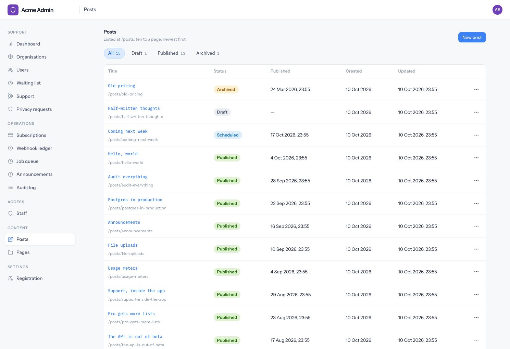
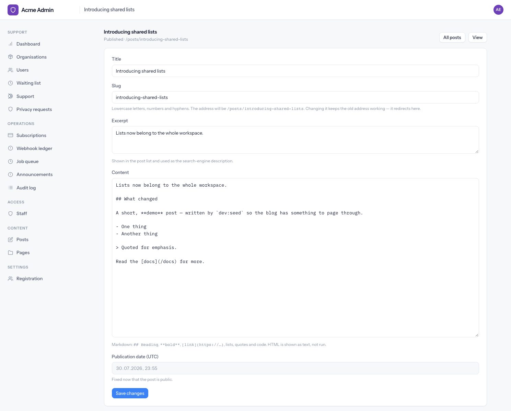
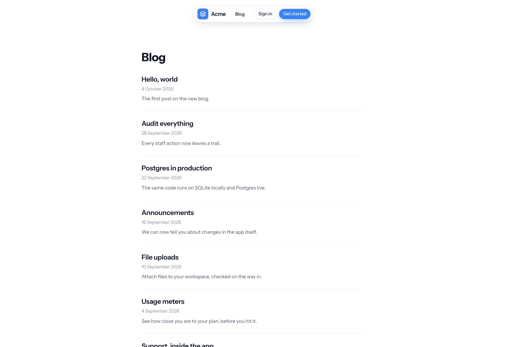
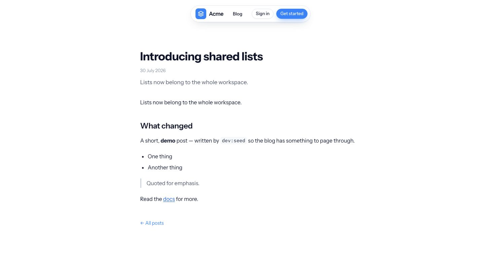

# Content

Posts and pages for the public site, written in the back office. Posts are a blog at `/posts`;
pages are reached only by their own address, like `/about-us`. Markdown in, safe HTML out.

This is a **removable module** — `app/modules/content/`. [Removing it](#removing-it) is a list of
deletions.

---

## Writing

**Admin → Content → Posts / Pages** (`/admin/content/posts`, `/admin/content/pages`), admin only.
Support staff do not see the section: whatever is written here is published under the company's
name, which is the same line the back office draws for announcements.



| Field | Posts | Pages | Notes |
|---|:-:|:-:|---|
| Title | ✓ | ✓ | |
| Slug | ✓ | ✓ | Blank means "make one from the title" |
| Excerpt | ✓ | | Shown in the list, and used as the search-engine description |
| Content | ✓ | ✓ | Markdown |
| Publication date | ✓ | | UTC. Blank means "when I publish it"; a future date schedules the post |

**New entries are drafts.** *Save and publish* does both in one click, but publishing is still its
own step in the audit log, so "who put this live?" always has one answer.



### States

| Status | On the site? | How it gets there |
|---|---|---|
| Draft | No | Every new entry; *Unpublish* |
| Published, date passed | **Yes** | *Publish* |
| Published, date in the future | No — shown as *Scheduled* | *Publish* with a future date |
| Archived | No | *Archive* |

Publishing stamps the publication date **once**. Unpublishing and publishing again keep it, and
while a post is live its date cannot be edited — the date readers saw is the date it keeps.

*Preview* shows any entry, in any state, in the public layout with a staff-only banner. *Delete*
asks first, and removes the entry and every old address that redirected to it.

Every create, edit, status change and delete is audited (`content.created`, `content.updated`,
`content.published`, `content.unpublished`, `content.archived`, `content.deleted`).

---

## Addresses

| | Address | Listed at `/posts`? |
|---|---|:-:|
| Post | `/posts/<slug>` | ✓ |
| Page | `/<slug>` | |

Pages are never added to any menu — linking to one is up to you.

**Slugs** are lowercase letters, numbers and single hyphens, unique across posts *and* pages.
A blank slug is made from the title and numbered if taken (`about`, `about-2`). Editing an entry
without touching its slug keeps the slug, even if the title changes.

**Renaming keeps old links working.** Change the slug of anything that has been published and the
old address answers with a `301` to the new one. Old addresses only redirect to something that is
live, so a redirect never reveals a draft, and nobody else can take a slug that still redirects.

### Reserved slugs

A page lives at the root, next to the application's own routes, so it must never take one of
their addresses. Rather than a list somebody has to keep up to date, the reserved slugs are **read
from the router** each time an entry is saved: the first segment of every registered route —
`login`, `admin`, `api`, `posts`, everything — plus `assets`, which the static file server answers
before the router is asked. A route added next year is reserved the day it is added.

Two further guards:

- `/:slug` is registered **last** in `start/routes.ts`, so a real route always wins, even over a page
  that somehow has its slug.
- A page saved *before* a route took its slug keeps the slug, and becomes unreachable. The Pages
  screen warns about every published page in that state, with a link to rename it.

---

## The blog

`/posts` lists live posts, **ten a page**, newest first; two posts published in the same second keep
the same order on every load. Page numbers mark the current one with `aria-current="page"`.
`/posts?page=2` works; a page past the last one is a `404`, and an empty blog says *Nothing
published yet*. A *Blog* link appears in the public site's header.



Every post and page gets a `<meta name="description">` (the excerpt, or the first 160 characters
of the text), a canonical URL, and OpenGraph tags. The base layout takes `description` and
`canonical` props for this, so any public page can use them.

---

## Markdown, safely

Bodies are Markdown, rendered with `markdown-it` on every read — never stored as HTML, so a fix to
the renderer reaches every post at once.

- **Raw HTML is escaped**, not passed through. There is no "trusted HTML" field anywhere in the
  module, so there is nothing to sanitise around.
- **Links and images** may point at `http`, `https`, `mailto` or a relative path. `javascript:`,
  `data:`, `vbscript:` and anything else render as plain text — including when disguised as
  `javascript&#58;`, because the check runs after entities are decoded.
- **External links** get `rel="noopener noreferrer"`.

The rendered body is the module's one unescaped print, in
`resources/views/pages/content/public/show.edge`, with a comment saying why. Typography comes from
the generic `.prose` class in `resources/css/components/prose.css`.



---

## Demo content

`node ace dev:seed` adds twelve live posts (two pages of blog), one scheduled, one draft, one
archived, and two pages — `/about-us`, with `/about` redirecting to it, and `/contact`.

---

## Where it lives

```
app/modules/content/
  models/            content_entry, content_slug_redirect
  services/          content_service, renderer (Markdown), slugs (format + reserved)
  controllers/admin/ the back-office screens
  controllers/public/ posts and pages
  audit_actions.ts   its audit actions, by augmentation
  validators.ts      the post/page form
  routes.ts          admin, blog and page routes
  schema_rules.ts    the type and status unions
  seeder.ts          its share of dev:seed
  tests/             unit (renderer, slugs) and functional (admin, public, reserved slugs)
```

Outside the folder, for the reasons [docs/modules.md](modules.md#step-1--delete-the-module) gives:
`resources/views/pages/content/` and the two migrations,
`1788600000026_create_content_entries_table.ts` and `1788600000027_create_content_slug_redirects_table.ts`.

---

## Removing it

Checked by doing it: with the module removed as below, the suite passes and `npm run typecheck` is
clean.

**1. Delete the module and its views.**

```bash
rm -rf app/modules/content resources/views/pages/content
rm docs/content.md
```

**2. Unregister it** — each is a block plus its import:

| File | What to remove |
|---|---|
| `start/routes.ts` | `registerContentPostRoutes()`, `registerContentPageRoutes()` and their import |
| `start/routes/admin.ts` | `registerContentAdminRoutes()` and its import |
| `start/seeders.ts` | `seeders.register(contentDemoSeeder)` and its import |
| `config/database.ts` | `#modules/content/schema_rules` in `rulesPaths`, on both connections |
| `app/models/public_id.ts` | `contentEntry: 'cnt'` |

**3. Update the modularity test.** Remove from `REGISTRATION_POINTS` in
`tests/unit/modularity.spec.ts` any file above that no longer names a module — with only this module
removed, that is `start/routes.ts`.

**4. Drop the dependency**, if nothing else uses it: `npm uninstall markdown-it @types/markdown-it`.

**5. Format.** `npm run format` tidies the blank lines the deletions leave behind.

Left alone on purpose, because they are generic and harmless without the module: the *Blog* link
and the admin *Content* section (both look for the module's routes by name and stand down), the
`description`/`canonical` props on the base layout, `.prose` in `prose.css`, and
`StaffPolicy.editPublicSite`.

{: .warning }
Do not delete the migrations. An existing database keeps both tables until you add a migration
that drops them:

```ts
// database/migrations/<timestamp>_drop_content_tables.ts
import { BaseSchema } from '@adonisjs/lucid/schema'

export default class extends BaseSchema {
  async up() {
    this.schema.dropTableIfExists('content_slug_redirects')
    this.schema.dropTableIfExists('content_entries')
  }
}
```

**Check:**

```bash
npm run typecheck
npm run lint
node ace test
```
