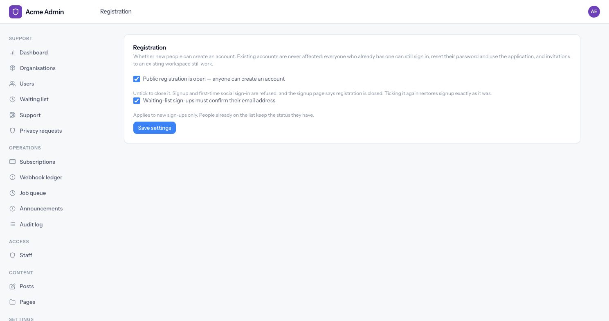
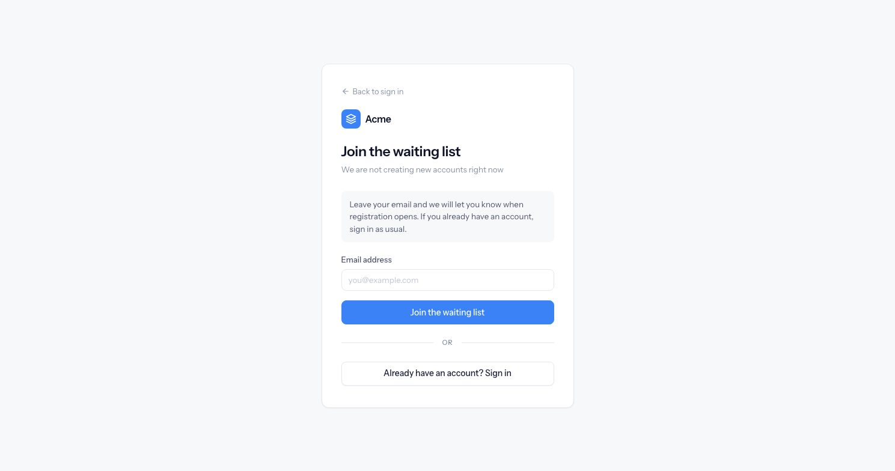
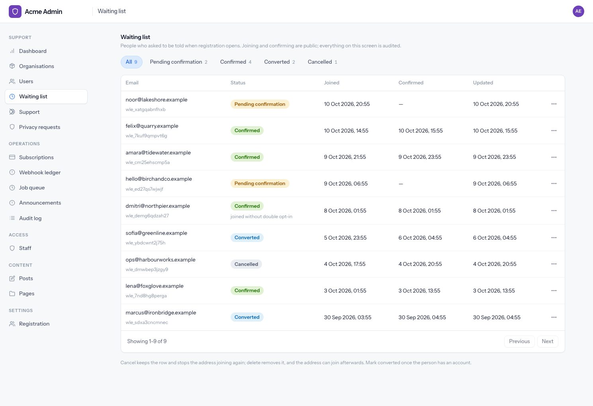

# Registration control

An administrator can close public signup at runtime, without a deploy. While it is closed, people
can join a waiting list instead. Existing accounts are never affected.

This is a **removable module** — `app/modules/registration_control/`. Without it, signup is simply
always open. [Removing it](#removing-it) is a list of deletions.

---

## Opening and closing registration

**Admin → Settings → Registration** (`/admin/settings/registration`), admin only.



| Setting | Default | What it does |
|---|---|---|
| Public registration is open | on | Off closes signup. On restores it exactly as it was. |
| Waiting-list sign-ups must confirm their email | on | Double opt-in for the waiting list. Applies to **new** sign-ups only. |

Both are runtime settings stored in `site_settings`, not environment variables. Each save writes a
`settings.changed` audit entry per setting that actually changed, with the value before and after;
saving without changing anything writes nothing.

### What "closed" means

| Path | While closed |
|---|---|
| `GET /signup` | Redirects to the waiting list |
| `POST /signup`, including a hand-made request | Refused before validation, nothing written, redirected to the waiting list |
| Signing in with Google/GitHub for the **first** time | Refused the same way |
| Signing in with Google/GitHub as an **existing** user | Works |
| Password sign-in, password reset, email verification, 2FA | Work |
| Accepting an invitation to an existing workspace | Works — adding a colleague is not public registration, and seats already limit it |

The check lives in core, in `RegistrationService.register()` — the one function that both signup
and first-time social sign-in reach — so no path can create an account around it. This module only
supplies the answer, through `registrationGate` (see
[Who may register](modules.md#who-may-register)).

---

## The waiting list

### From the public side

`/waitlist` is only offered while registration is closed; while it is open, the page and the form
both redirect to `/signup`.



Every submission gets the same answer — *"If this email can be added to the waiting list, we will
send further instructions."* — whatever happened:

| The address… | What happens |
|---|---|
| is new | An entry is created. With double opt-in, a confirmation email is queued. |
| is already waiting for confirmation | A **new** confirmation link is sent; the old one stops working |
| is already confirmed or converted | Nothing |
| was cancelled by staff | Nothing — the public form is not a way round a cancel |
| already has an account | Nothing: no entry and no email |

That last row is the point. If the form behaved differently for an address with an account, anyone
could use it to find out who has one. Addresses are trimmed and lowercased, so `Jane@Example.COM`
and `jane@example.com` are one entry.

**Confirmation links** are 32 random bytes, stored only as a sha256 hash, valid for 48 hours, and
land on a page that says *confirmed*, *already confirmed*, *expired* or *not valid* — never the
address. An expired link's page tells the person to join again, which sends a fresh one.

**Rate limits:** 5 submissions an hour per IP address, and 3 a day per email address (the second
protects the mailbox on the other end from somebody using the form to spam it).

Changing the double opt-in setting never touches existing entries: someone who joined while it was
on stays pending until they confirm.

### From the back office

**Admin → Waiting list** (`/admin/waitlist`), support and admin.



Filters for all, pending confirmation, confirmed, converted and cancelled, each with a count; 50
rows a page, newest first.

| Action | Available when | Effect |
|---|---|---|
| Resend link | Pending, under double opt-in | New link sent, old one retired |
| Mark converted | Pending or confirmed | The person has an account now |
| Cancel | Not already cancelled | Link stops working; the address cannot rejoin through the form |
| Delete | Always, after a browser confirm | Row removed; the address can join again |

Every action is audited (`waitlist.cancelled`, `waitlist.converted`, `waitlist.resent`,
`waitlist.deleted`) with the status before and after. A refused action — converting a cancelled
entry, say — is a flash message and is not audited.

### Conversion, nightly

`mark_waiting_list_converted` runs daily. Pending and confirmed entries whose address now has an
account become `converted`, each with a system audit entry. Cancelled entries are left alone. It
is a sweep rather than a hook in signup so that core's registration code never has to know the
waiting list exists.

### What is deliberately not here

No invitations or bulk "let these people in" flow, no ranking, no newsletter. The list records
who asked; letting them in is opening registration. See plan §22.12.

### Demo data

`node ace dev:seed` adds nine entries across all four states, one of them joined without double
opt-in. Registration itself is left open.

---

## Where it lives

```
app/modules/registration_control/
  settings.ts        the two settings, their defaults, and the gate resolver
  models/            waiting_list_entry
  services/          waiting_list_service — join, confirm, admin actions
  controllers/       registration settings, public waiting list, admin waiting list
  jobs/              mark_waiting_list_converted_job
  mails/             waiting_list_confirmation_notification
  audit_actions.ts   its audit actions, by augmentation
  throttles.ts       the two waiting-list rate limits
  validators.ts      the settings form and the join form
  routes.ts          admin, guest and token routes, registered from core's groups
  schema_rules.ts    status union and the boolean column
  seeder.ts          its share of dev:seed
  tests/functional/  settings, waiting list, admin screen, conversion job
```

Outside the folder, for the reasons [docs/modules.md](modules.md#step-1--delete-the-module) gives:
`resources/views/pages/registration_control/`, `resources/views/emails/waiting_list_confirmation*.edge`
and `database/migrations/1788600000025_create_waiting_list_entries_table.ts`.

---

## Removing it

Checked by doing it: with the module removed as below, the suite passes and `npm run typecheck` is
clean.

**1. Delete the module and its views.**

```bash
rm -rf app/modules/registration_control resources/views/pages/registration_control
rm resources/views/emails/waiting_list_confirmation*.edge
rm docs/registration-control.md
```

**2. Unregister it** — each is a block plus its import:

| File | What to remove |
|---|---|
| `start/settings.ts` | `registerRegistrationSettings()` and its import. Nothing else is registered there yet, so delete the file and its `() => import('#start/settings')` line in `adonisrc.ts` |
| `start/routes/admin.ts` | `registerRegistrationAdminRoutes()` and its import |
| `start/routes/auth.ts` | `registerWaitingListGuestRoutes()`, `registerWaitingListTokenRoutes()` and their import |
| `start/jobs.ts` | the Registration Control block and its import |
| `start/seeders.ts` | `seeders.register(registrationControlDemoSeeder)` and its import |
| `config/database.ts` | `#modules/registration_control/schema_rules` in `rulesPaths`, on both connections |
| `app/models/public_id.ts` | `waitingListEntry: 'wle'` |

**3. Update the modularity test.** `tests/unit/modularity.spec.ts` requires every registration
point to still import a module. Remove from `REGISTRATION_POINTS` any file above that no longer
names one — today that is `start/settings.ts`, `start/routes/admin.ts` and `start/routes/auth.ts`.

**4. Format.** `npm run format` tidies the blank lines the deletions leave behind.

Nothing else needs an edit. The admin sidebar items, the signup redirect and the "registration is
closed" handling all look for the module's routes by name and stand down when they are gone.
Signup is open again, because the registration gate answers *open* when nothing has registered an
answer — there is no setting to reset, and any `registration_enabled` row left in `site_settings`
is simply never read.

{: .warning }
Do not delete the migration. An existing database keeps the `waiting_list_entries` table until you
add a migration that drops it:

```ts
// database/migrations/<timestamp>_drop_waiting_list_entries_table.ts
import { BaseSchema } from '@adonisjs/lucid/schema'

export default class extends BaseSchema {
  async up() {
    this.schema.dropTableIfExists('waiting_list_entries')
  }
}
```

**Check:**

```bash
npm run typecheck
npm run lint
node ace test
```
